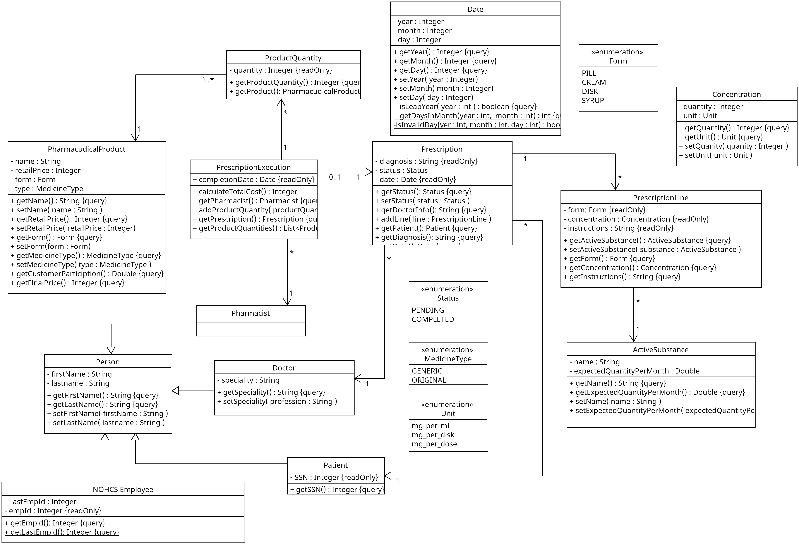

## Σχεδίαση και υλοποίηση της λογικής του πεδίου

### Διάγραμμα κλάσης στατικής λογικής
Το διάγραμμα ακολουθεί την λογική του [domain model](./PNGs/domainModel.png). Η κατεύθυνση των συσχετήσεων και οι μέθοδοι καθορίζονται από τις λειτουργικές απαιτήσεις της εφαρμογής.

### Κάλυψη κώδικα
Επιδιώκουμε υψηλή κάλυψη κώδικα, μιας και οι κλάσεις είναι σχετικά απλές (average 40 lines) χωρίς ιδιαίτερα μεγάλο branching factor (με εξέρεση το Date.java). 
