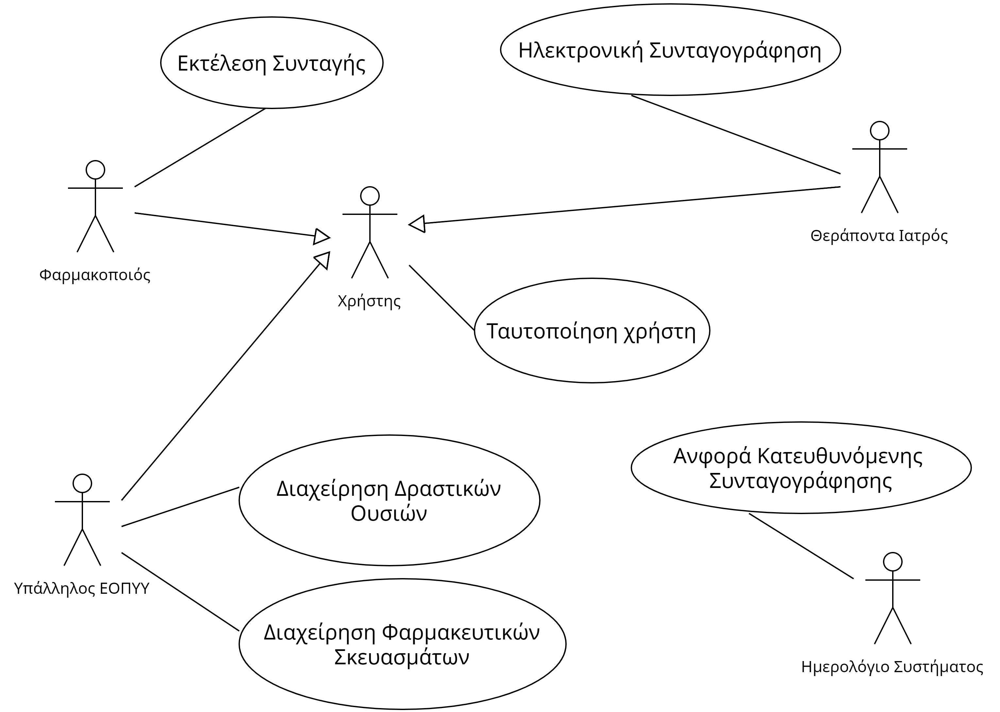

## Απαιτησεις λογισμικου - Εφαρμογή ηλεκτρονικής συνταγογράφησης

Το λογισμικό θα υποστηρίζει την ηλεκτρονική συνταγογράφηση φαρμάκων και αναλωσίμων. Θα επιτρέπει στους ιατρούς, φαρμακοποιούς και υπαλλήλους του ΕΟΠΥΥ να εκτελλούν όλες τις απαραίτητες ενεργειες ώστε ο πελάτης να λάβει τα φάρμακα που χρειάζεται.

* Ο **υπάλληλος του ΕΟΠΥΥ**, θα μπορεί :
    * να καταχώρει όλες τις δραστικές ουσίες, καθώς και τα εγκεκριμένα φαρμακευτικά σκευάσματα (γενόσημα ή πρωτότυπα) που αντιστοιχούν σε αυτές.

* Ο **θεράποντας γιατρός**, θα έχει την δυνατότητα:
    * να καταχωρεί μια ιατρική συνταγή μετά από αναζήτηση του προφίλ του ασφαλισμένου με χρήση του ΑΜΚΑ του.
    * να επιλέγει τον τύπο σκευασμάτων/φαρμάκων με βάση τη δραστική τους ουσία, καθώς και των τεμαχίων του καθενός που θα πρέπει να χορηγηθεί στον ασθενή.

*  Ο **φαρμακοποιός** θα μπορεί:
    * να εκτελεί τη συνταγή και να χορηγεί στον ασθενή τα τεμάχια φαρμάκων που αντιστοιχούν στις δραστικές ουσίες της συνταγής.
    * να χρεώνει τον πελάτη ανάλογα με το αν επέλεξε γενόσημα ή πρωτότυπα φαρμακευτικά σκευάσματα.

*  Η υπηρεσία θα παράγει κάθε μήνα λίστα με τους ιατρούς που πιθανό είναι υπεύθυνοι για κατευθυνόμενη συνταγογράφηση καθώς και το πληθος των συνταγών τους που ξεπερνούν το όριο ανά μήνα και θα την στελνει στην διοίκηση του ΕΟΠΥΥ.
*  Η πρόσβαση στο σύστημα θα γίνεται μέσω παροχής κατάλληλων διαπιστευτηρίων
*  Στην συνταγή καταγράφονται επιπλέον τα στοιχεία του θεράποντος ιατρού καθώς και η διάγνωση που έχει γίνει.

