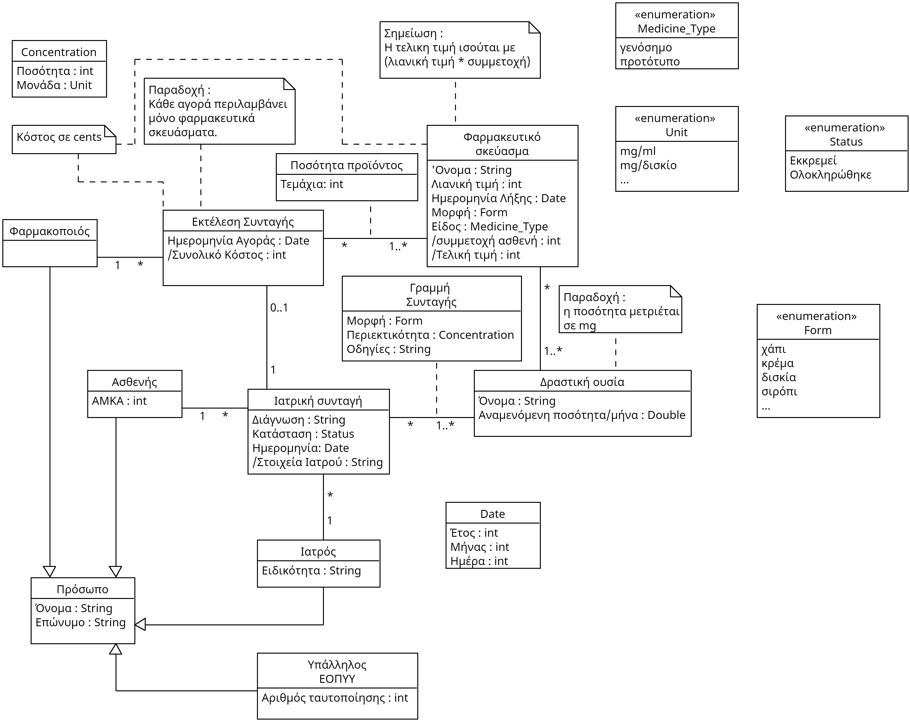
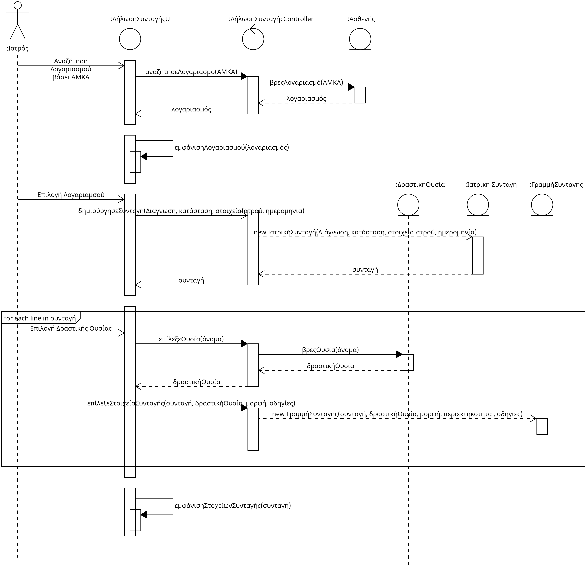
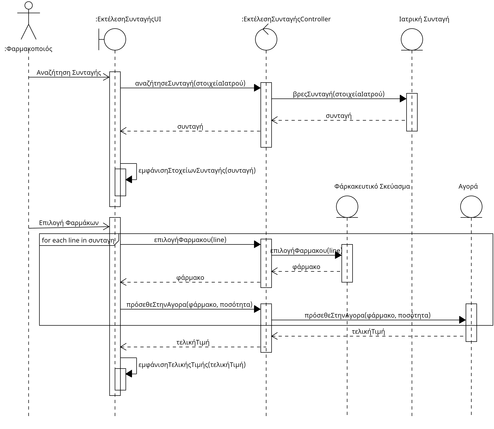
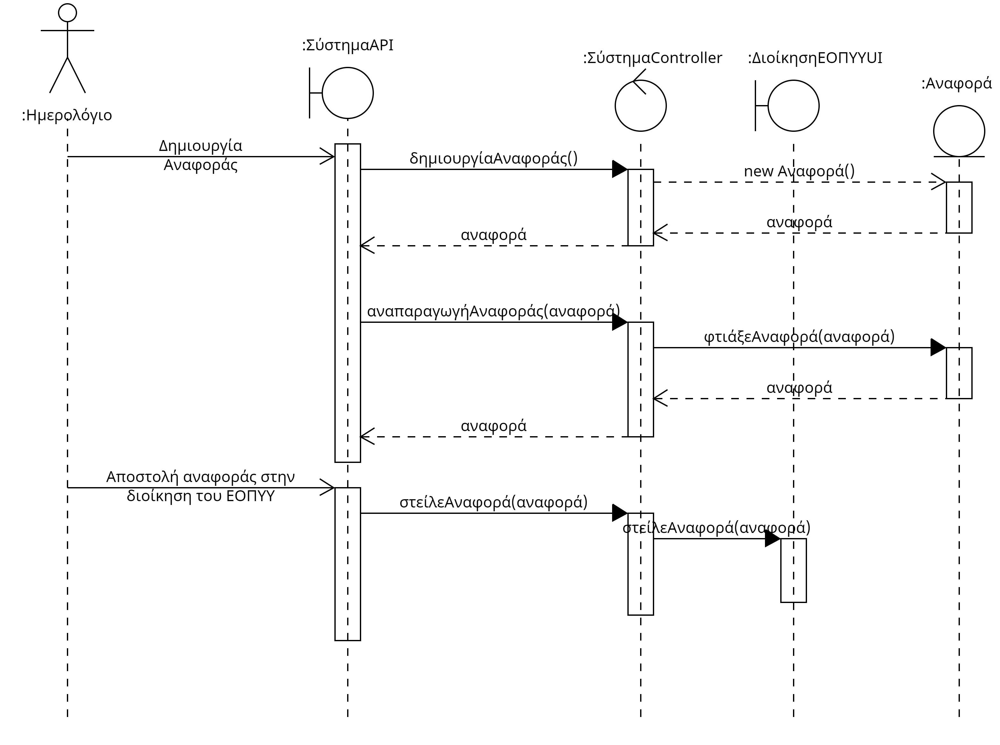
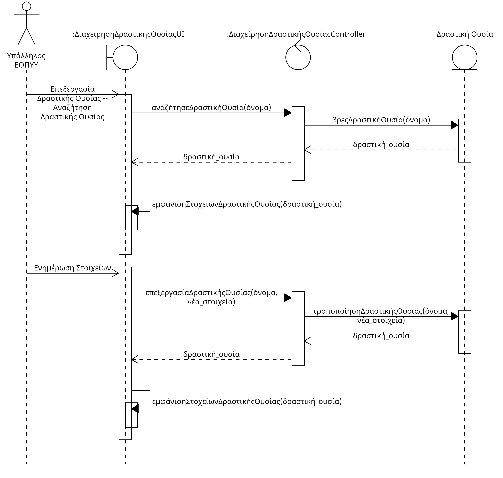
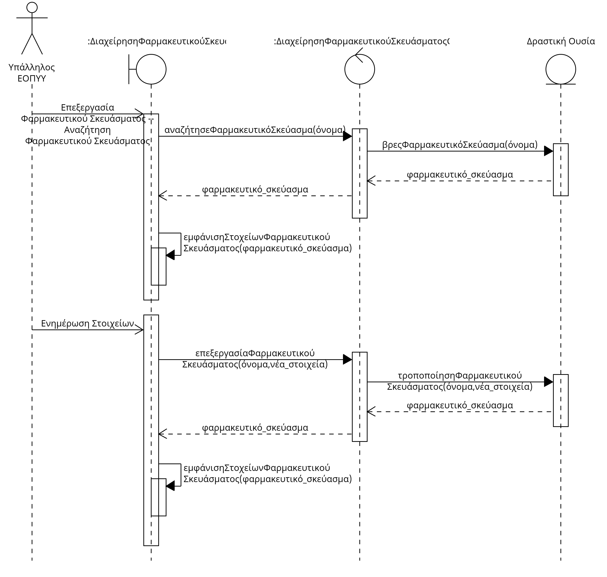

## Απαιτησεις λογισμικου - Εφαρμογή ηλεκτρονικής συνταγογράφησης

Το λογισμικό θα υποστηρίζει την ηλεκτρονική συνταγογράφηση φαρμάκων και αναλωσίμων. Θα επιτρέπει στους ιατρούς, φαρμακοποιούς και υπαλλήλους του ΕΟΠΥΥ να εκτελλούν όλες τις απαραίτητες ενεργειες ώστε ο πελάτης να λάβει τα φάρμακα που χρειάζεται.

* Ο **υπάλληλος του ΕΟΠΥΥ**, θα μπορεί :
    * να καταχώρει όλες τις δραστικές ουσίες, καθώς και τα εγκεκριμένα φαρμακευτικά σκευάσματα (γενόσημα ή πρωτότυπα) που αντιστοιχούν σε αυτές.

* Ο **θεράποντας γιατρός**, θα έχει την δυνατότητα:
    * να καταχωρεί μια ιατρική συνταγή μετά από αναζήτηση του προφίλ του ασφαλισμένου με χρήση του ΑΜΚΑ του.
    * να επιλέγει τον τύπο σκευασμάτων/φαρμάκων με βάση τη δραστική τους ουσία, καθώς και των τεμαχίων του καθενός που θα πρέπει να χορηγηθεί στον ασθενή.

*  Ο **φαρμακοποιός** θα μπορεί:
    * να εκτελεί τη συνταγή και να χορηγεί στον ασθενή τα τεμάχια φαρμάκων που αντιστοιχούν στις δραστικές ουσίες της συνταγής.
    * να χρεώνει τον πελάτη ανάλογα με το αν επέλεξε γενόσημα ή πρωτότυπα φαρμακευτικά σκευάσματα.

*  Η υπηρεσία θα παράγει κάθε μήνα λίστα με τους ιατρούς που πιθανό είναι υπεύθυνοι για κατευθυνόμενη συνταγογράφηση καθώς και το πληθος των συνταγών τους που ξεπερνούν το όριο ανά μήνα και θα την στελνει στην διοίκηση του ΕΟΠΥΥ.
*  Η πρόσβαση στο σύστημα θα γίνεται μέσω παροχής κατάλληλων διαπιστευτηρίων
*  Στην συνταγή καταγράφονται επιπλέον τα στοιχεία του θεράποντος ιατρού καθώς και η διάγνωση που έχει γίνει.

## Ειδικές Απαιτήσεις

### Περιπτώσεις Χρήσης

#### ΠΧ1. [Ηλεκτρονική συνταγογράφηση](./use%20case%20descreptions/uc1_complete_prescription.md)
#### ΠΧ2. [Εκτέλεση Συνταγής](./use%20case%20descreptions/uc2_execute_prescription.md)
#### ΠΧ3. [Ταυτοποίηση Χρήστη](./use%20case%20descreptions/uc3_identify_user.md)
#### ΠΧ4. [Αναφορά κατευθυνόμενης συντaγογράφησης](./use%20case%20descreptions/uc4_generate_report.md)
#### ΠΧ5. [Διαχείρηση Δραστικών Ουσιών](./use%20case%20descreptions/uc5_manage_active_substances.md)
#### ΠΧ6. [Διαχείρηση Φαρμακευτικών Σκευασμάτων](./use%20case%20descreptions/uc6_manage_pharmaceutical_products.md)

## Συμπληρωματικές προδιαγραφές

## Ανάλυση Μη Λειτουργικών Απαιτήσεων
### Σύστημα: Παρακάτω οι σημαντικότερες μη λειτουργικές απαιτήσεις του συστήματος
* **Ακεραιότητα και Ασφάλεια:** Δεδομένου της σημαντικότητας των ιατρικών δεδομένων, τόσο για την σωστή όσο και για την ασφαλή εξυπηρέτηση των ασθενών, είναι κρίσιμο να διατηρείται η ακεραιότητα της πληροφορίας του συστήματος, και ειδικά των συνταγών και των κωδικών ασφαλείας των λογαριασμών.
* **Ευρωστία:** Το σύστημα οφείλει να ξέρει να χειριστεί σωστά οποιοδήποτε λάθος input του χρήστη (πχ. εισαγωγή συμβολοσειράς αντί για νούμερο στο ΑΜΚΑ)
* **Απόδοση:** Παρόλο που η απόδοση δεν είναι τόσο σημαντική μετρική στο συγκεκριμένο σύστημα, θα πρέπει η εξυπηρέτηση των χρηστών να πραγματοποιείται σε λογικό χρονικό πλαίσιο.
* **Αξιοπιστία:** Το σύστημα πρέπει να λειτουργεί σύμφωνα με το πως έχει σχεδιαστεί, αφού δυσλειτουργίες του συστήματως μπορούν να οδηγήσουν σε σοβαρά προβλήματα (πχ. λήψη λάθος φαρμάκων)
* **Ευχρηστία:** Ένα εύκολο στην χρήση σύστημα θα επιτρέψει σε όλους τους χρήστες να τελέσουν το έργοτους γρήγορα και αποτελεσματικά.
* **Διαθεσιμότητα:** Είναι σημαντικό το σύστημα να είναι διαθέσιμο ανα πάσα στιγμή και να μην υποκύπτει σε σφάλματα που εμποδίζουν την λειτουργία του, αλλιώς θα διακόπτεται μια πολύ σημαντική ιατρική υπηρεσία. 
* **Ελεγξιμότητα και Συντηρησιμότητα:** Το σύστημα θα πρέπει να εντοπίζει εύκολα προβλήματα, να μπορεί να τα αντιμετοπίζει και να είναι σχεδιασμένο με τρόπο τέτοιο ώστε να επιτρέπει μελλοντικές τροποποιήσεις. 
* **Διαλειτουργικότητα:** Θα πρέπει να δύναται το σύστημα να επικοινωνεί με λοιπά ιατρικά συστήματα ή συστήματα που σχετίζονται με την παροχή σκευασμάτων και δραστικών ουσιών για την ανταλλαγή πληροφοριών.

# Υποστηρικτικό υλικό

## Μοντέλο πεδίου

## Ανάλυση περιπτώσεων χρήσης
--------------------------

### Συμπεριφορές

#### Ηλεκτρονική Συνταγογράφηση

#### Εκτέλεση Συνταγής

#### Ταυτοποίηση Χρήστη

#### Δημιουργία Αναφοράς

#### Διαχείρηση Δραστικών Ουσιών

#### Διαχείρηση Φαρμκευτικών Σκευασμάτων

