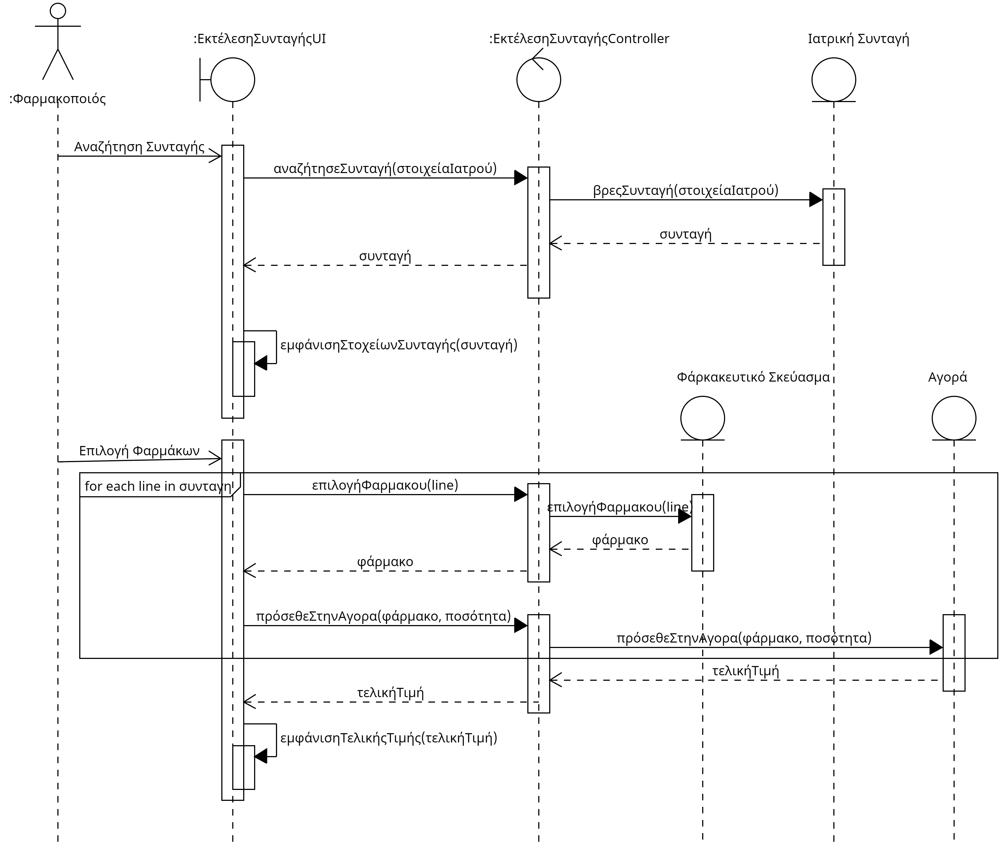
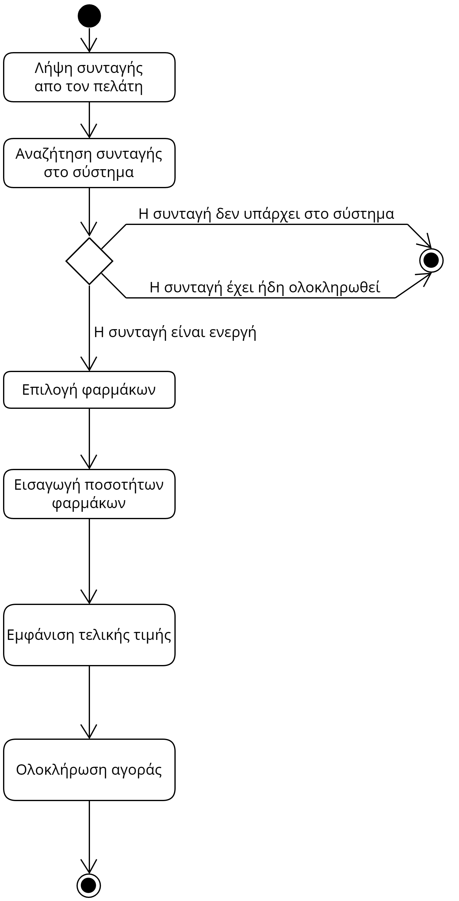

# ΠΧ2. Εκτέλεση Συνταγής
**Πρωτεύων Actor**: Φαρμακοποιός
**Ενδιαφερόμενοι**:
**Ασθενής**: Θέλει να εκτελεστή η συνταγή προκειμένου να χορηγηθεί τα φάρμακα που χρειάζεται.
**Φαρμακοποιός**: Χρειάζεται στην συνταγή για να τελέσει τα καθήκοντά του.
**Προϋποθέσεις**: Ο Φαρμακοποιός έχει εκτελέσει με επιτυχία την περίπτωση χρήσης “Ταυτοποίηση χρήστη”.

## Βασική Ροή
Α) Εκτέλεση συνταγής
1. Ο φαρμακοποιός λαμβάνει την ιατρική συνταγή από τον πελάτη.
2. Ο φαρμακοποιός αναζητητεί την ιατρική συνταγή στο σύστημα με βάση τα στοιχεία του ιατρού. 
3. Το σύστημα εμφανίζει την συνταγή.
4. O φαρμακοποιός διαβάζει την συνταγή.
5. Ο φαρμακοποιός αναζητεί τα φαρμακευτικά σκευάσματα που αντιστοιχούν στις δραστικές ουσίες της συνταγής.
6. Ο φαρμακοποιός επιλέγει τα επιθυμητά σκευάσματα.
7. Το σύστημα προτρέπει την εισαγωγή ποσότητας για το κάθε σκεύασμα.
8. Ο φαρμακοποιός εισάγει τις απαιτούμενες ποσότητες
9. Το σύστημα εμφανίζει το συνολικό κόστος ανάλογα με την συμμετοχή του ασθενή.
10. Ο φαρμακοποιός δίνει στον πελάτη τα φάρμακα και λαμβάνει την πληρωμή του.
   
## Εναλλακτικές Ροές
*3α. Η συνταγή δεν υπάρχει στο σύστημα.*
  1. Η περίπτωση χρήσης τερματίζει.
*3β. Η συνταγή υπάρχει, αλλά έχει ήδη ολοκληρωθεί.*
  1. Η περίπτωση χρήσης τερματίζει

## Sequence Diagram

## Activity Diagram
