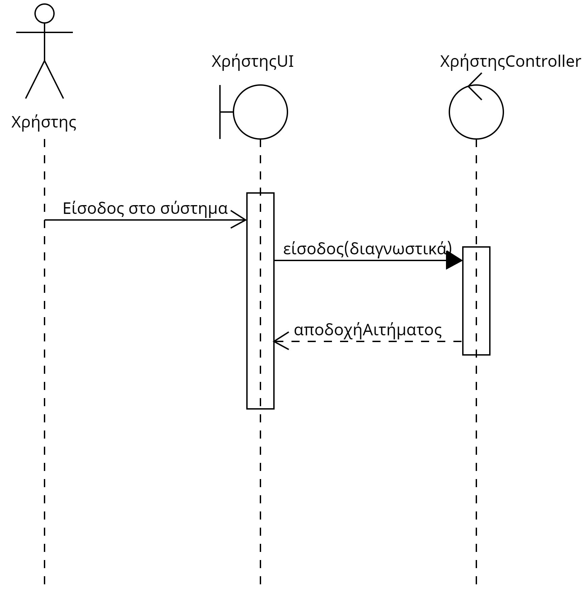
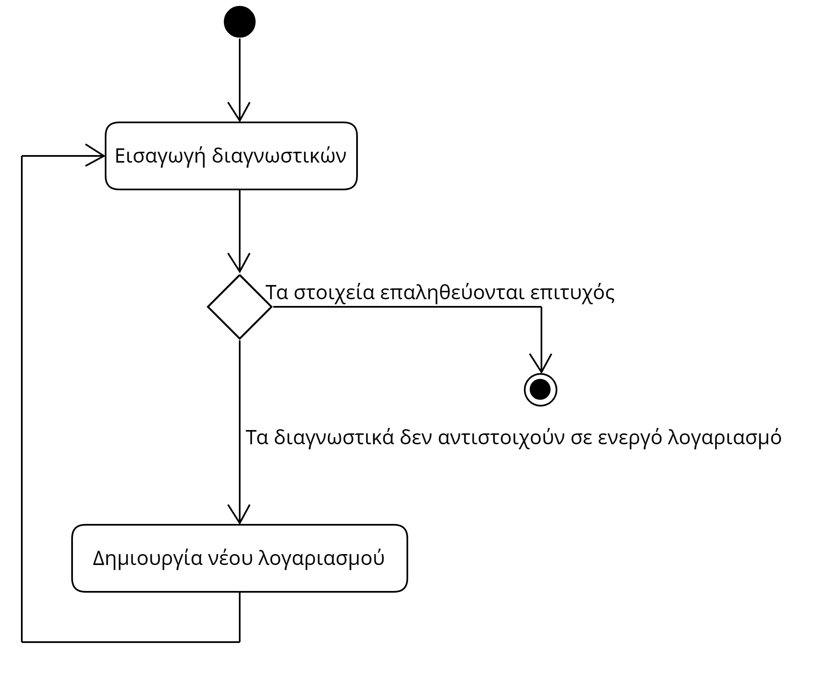

# ΠΧ3. Ταυτοποίηση Χρήστη
**Πρωτεύων Actor**: Χρήστης

**Ενδιαφερόμενοι**: **Χρήστης** 

**Προϋποθέσεις**: Να είναι ενεργό το σύστημα

## Βασική Ροή
Α) Ταυτοποίηση
1. Ο χρήστης εισάγει τα διαγνωστικά του.
2. Ο χρήστης έχει πρόσβαση στίς υπηρεσίες της εφαρμογής
   
## Εναλλακτικές Ροές
*1α. Τα διαγνωστικά δεν αντιστοιχούν σε ενεργό λογαριασμό*
   1. Ο χρήστης δημιουργεί νέο λογαριασμό
   2. Ο χρήστης επαναλαμβάνει το βήμα 1 της βασικής ροής

## Sequence Diagram

## Activity Diagram
