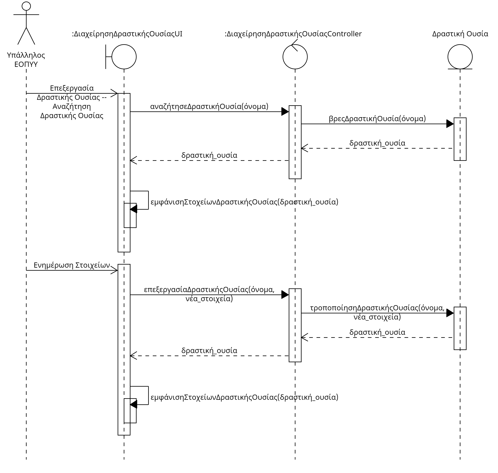

# ΠΧ5. Διαχείρηση Δραστικών Ουσιών
**Πρωτεύων Actor**: Υπάλληλος ΕΟΠΥΥ  
**Ενδιαφερόμενοι**  
**Υπάλληλος ΕΟΠΥΥ** Θέλει να μπορεί να διαχειριστεί τις δραστικές ουσίες διαθέσιμες προς συνταγογράφηση.  
**Θεράπων Ιατρός**: Θέλει να γνωρίζει ποιες ουσίες δύναται να συνταγογραφήσει στους ασθενής του.  
**Φαρμακοποιός**: Θα πρέπει να γνωρίζει τις δραστικές ουσίες που επιτρέπεται να του ζητηθούν και τα φαρμακευτικά σκευάσματα που αντιστοιχούν σε αυτές.  
**Προϋποθέσεις**: Ο Υπάλληλος ΕΟΠΠΥ έχει εκτελέσει με επιτυχία την περίπτωση χρήσης “Ταυτοποίηση χρήστη”.

## Βασική Ροή

### Α) Εγγραφή Νέας Δραστικής Ουσίας
1. Ο υπάλληλος ΕΟΠΠΥ επιλέγει την εγγραφή νέας δραστικής ουσίας.
2. Ο υπάλληλος εισάγει το όνομα και την αναμενόμενη ποσότητα ανά μήνα της δραστικής ουσίας.
3. Το σύστημα αποθυκεύει την δραστική ουσία.

## Εναλλακτικές Ροές

*2α. Υπάρχει ήδη δραστική ουσία καταχωρημένη στο σύστημα με ίδιο όνομα.*
1. Το σύστημα εμφανίζει μήνυμα σφάλματος.
2. Η περίπτωση χρήσης τερματίζει.

### Β) Ενημέρωση Στοιχείων Δραστικής Ουσίας
1. Ο υπάλληλος ΕΟΠΠΥ επιλέγει την ενημέρωση στοιχείων δραστικής ουσίας.
2. Ο υπάλληλος αναζητά στο σύστημα για την δραστική ουσία που θέλει να επεξεργαστεί με το όνομα της, που είναι μοναδικό.  
   *2α. Το σύστημα δεν βρίσκει την δραστική ουσία που αναζητήθηκε.
    1. Το σύστημα εμφανίζει μήνυμα σφάλματος.
    2. Η ΠΧ επιστρέφει στην Βασική Ροή Α.
3. Ο υπάλληλος επεξεργάζεται το όνομα και την αναμενόμενη ποσότητα ανά μήνα της δραστικής ουσίας.
4. Το σύστημα αποθυκεύει τα στοιχεία της δραστικής ουσίας.

### Γ) Διαγραφή Δραστικής Ουσίας
1. Ο υπάλληλος ΕΟΠΠΥ επιλέγει την διαγραφή δραστικής ουσίας.
2. Ο υπάλληλος αναζητά στο σύστημα για την δραστική ουσία που θέλει να επεξεργαστεί με το όνομα της, που είναι μοναδικό.  
   *2α. Το σύστημα δεν βρίσκει την δραστική ουσία που αναζητήθηκε.
    1. Το σύστημα εμφανίζει μήνυμα σφάλματος.
    2. Η περίπτωση χρήσης τερματίζει.
3. Η δραστική ουσια διαγράφεται απο το σύστημα.
4. Το σύστημα εμφανίζει μήνυμα επιτυχίας μαζί με τα στοιχεία της δραστικής ουσίας που διαγράφηκε.

